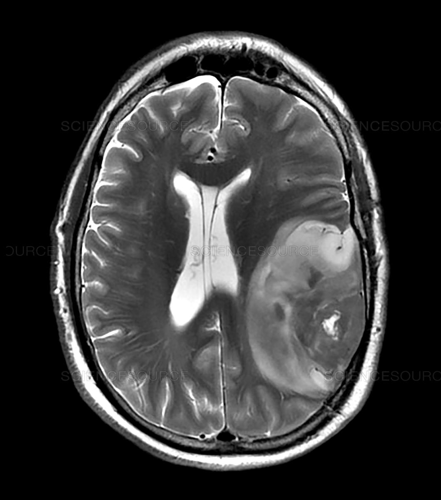
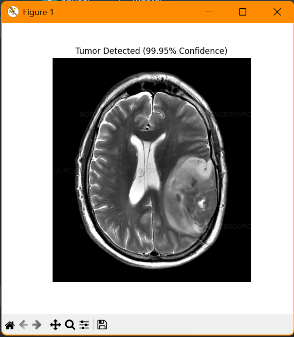

## 🧠 Brain Tumor Detector – AI-Powered MRI Classifier for Early Diagnosis


---

***🧬 "Smarter scans. Faster answers. One upload away."***
Brain Tumor Detector is a full-stack AI web app that analyzes MRI images and detects brain tumors using a trained CNN model. Designed with precision in the backend and polish in the frontend — ready for clinical-grade demos or portfolio showcases.

---

## 🧠 What It Does
🖼️ Upload MRI Brain Scans

🧠 Detects Presence of Tumor Using CNN

📊 Confidence Score with Classification Output

🎨 Modern UI with Drag & Drop Uploads

⚙️ Fast Inference via Flask API + Keras Backend

---

## 🛠️ Tech Stack
Layer	Tech Used
Frontend	HTML5, CSS3, JavaScript, Bootstrap
Backend	Python, Flask
AI Model	TensorFlow/Keras CNN
Image Tools	OpenCV, Pillow
Utilities	NumPy, Pandas

---
## 📂 Folder Structure
```bash
📁 Brain-Tumor-Detector/
├── Images/                
├── brain_tumor_model.h5               
├── app.py                
├── training.py              
├── requirements.txt
└── README.md
```
---

## Download the model:

[Click here to download model](https://drive.google.com/file/d/1x0EYoSp9Kcrws_bDp4gPQfkLIpnNxTjq/view?usp=sharing)

Place brain_tumor_model.h5 in the project root folder.

---

## 🚀 Getting Started
```bash
# 1. Clone the project
git clone https://github.com/n-bharath-chowdary/Brain-Tumor-Detector.git
cd Brain-Tumor-Detector

# 2. Create a virtual environment
python -m venv venv
source venv/bin/activate  # or venv\Scripts\activate on Windows

# 3. Install dependencies
pip install -r requirements.txt

# 4. Run the app
python app.py
```
---

## 📷 Demo Screens
🧠 Upload. Detect. Done.
🎨 Built to impress, designed to serve.

---

## 📸 Sample Inputs and Outputs

| Input MRI | Output Detection |
|----------|------------------|
|  |  |
|  |  |

---

## 📚 Dataset Used
Kaggle Brain MRI Dataset (Tumor vs No Tumor)

Preprocessed & balanced for binary classification

---

## 📢 Contribute

Got ideas? Found a bug?
Open an Issue or submit a Pull Request – all contributions are welcome!


---

## 📄 License

This project is licensed under the MIT License. See the LICENSE file for details.


---

## 💬 Connect

## 🙋‍♂️ Author
#### Bharath Chowdary
##### [GitHub](https://github.com/n-bharath-chowdary) 
##### [LinkedIn](https://www.linkedin.com/in/n-bharath-chowdary/)
---

